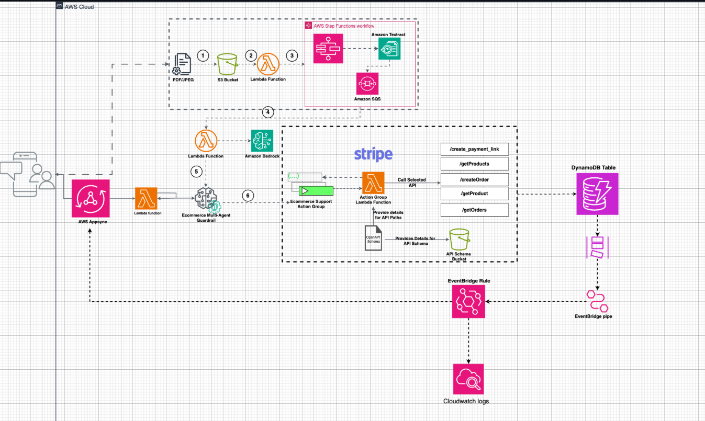
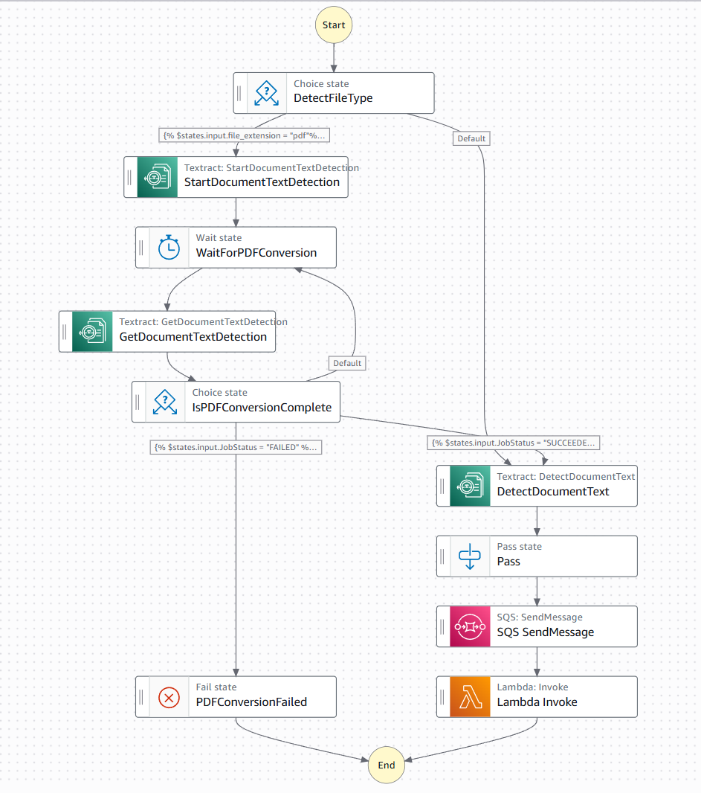

# 🛒 Grocerly — AI-Powered E-Commerce Automation Platform

Grocerly is a **serverless AI-driven e-commerce orchestration platform** that integrates **AWS Bedrock, Textract, Step Functions, SQS, Lambda, AppSync, and DynamoDB** to create a fully automated system for document processing, payment management, and multi-agent task execution.  
It demonstrates a production-grade pipeline for **automating product ingestion, order management, payment handling (Stripe), and intelligent agent-based workflow control**.

---

## 🚀 Key Features

- **Automated Document Processing**
  - Uses **Amazon Textract** to extract structured data from PDFs and images.
  - Integrated **AWS Step Functions** to manage asynchronous document conversion and text detection workflows.

- **E-Commerce AI Workflow**
  - Bedrock-powered **multi-agent guardrail** system for safe and intelligent task execution.
  - **Lambda-based orchestration** for order management, payment link generation, and support tasks.

- **Event-Driven Architecture**
  - **S3 triggers** for uploads.
  - **SQS + EventBridge + CloudWatch Logs** for observability and fault tracing.
  - **DynamoDB** for storing and querying processed data efficiently.

- **Stripe Integration**
  - Automated **payment link generation**, **order creation**, and **product retrieval**.
  - Uses Bedrock Action Groups for natural language-to-API invocation.

---

## 🧩 Architecture Overview

### 🖇️ High-Level System Design

The architecture connects AWS AppSync → Lambda → Bedrock → Textract → Stripe APIs in a modular, event-driven fashion.



#### Core Components:
| Layer | Description |
|-------|--------------|
| **Frontend (AppSync)** | Accepts client queries and routes them to backend workflows. |
| **Step Functions** | Coordinates Textract-based document parsing and state transitions. |
| **Lambdas** | Core business logic (product actions, Stripe payments, Bedrock integration). |
| **Amazon Bedrock** | Hosts the AI agents for contextual understanding and decision routing. |
| **DynamoDB** | Stores product and order metadata. |
| **EventBridge + CloudWatch** | Enables automation, monitoring, and event routing. |

---

## 🧠 AWS Step Functions Workflow

The document processing pipeline performs PDF detection, Textract job polling, and failure handling with retries.



**Workflow Steps:**
1. **DetectFileType** – Checks if the uploaded file is a PDF or image.
2. **StartDocumentTextDetection** – Initiates Textract job for text extraction.
3. **WaitForPDFConversion** – Waits for job completion (polling).
4. **GetDocumentTextDetection** – Retrieves Textract job results.
5. **IsPDFConversionComplete** – Evaluates status (`SUCCEEDED` or `FAILED`).
6. **DetectDocumentText** – Parses text results on success.
7. **SQS SendMessage / Lambda Invoke** – Sends parsed data for downstream use or triggers agents.

---

## ⚙️ Tech Stack

| Category | Tools & Services |
|-----------|------------------|
| **AI/LLM** | Amazon Bedrock (Multi-Agent Guardrail, Action Groups) |
| **Compute** | AWS Lambda, Step Functions |
| **Storage** | S3, DynamoDB |
| **Messaging** | Amazon SQS, EventBridge |
| **Monitoring** | CloudWatch Logs |
| **Frontend/API** | AWS AppSync, OpenAPI Schema |
| **Payments** | Stripe API |
| **Security** | IAM, Guardrails, Fine-grained API roles |

---

## 🧰 Deployment

### Prerequisites
- AWS Account with permissions for:
  - Textract, Step Functions, Bedrock, SQS, Lambda, AppSync, DynamoDB
- Stripe API credentials
- Node.js ≥ 18.x
- AWS CDK or Terraform for IaC (optional)

### Deployment Steps

```bash
# Clone the repository
git clone https://github.com/smaliaquib/Grocerly.git
cd Grocerly

# Configure AWS credentials
aws configure

# Deploy the serverless stack
sam deploy --guided
# or
cdk deploy
